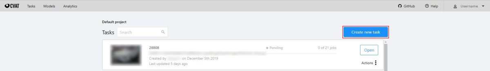

- [User's guide](#users-guide)
  - [Getting started](#getting-started)
    - [Authorization](#authorization)
    - [Administration panel](#administration-panel)
    - [Creating an annotation task](#creating-an-annotation-task)
    - [Models](#models)
    - [Search](#search)
  - [Interface of the annotation tool](#interface-of-the-annotation-tool)
    - [Basic navigation](#basic-navigation)
    - [Types of shapes (basics)](#types-of-shapes-basics)
    - [Shape mode (basics)](#shape-mode-basics)
    - [Track mode (basics)](#track-mode-basics)
    - [Attribute annotation mode (basics)](#attribute-annotation-mode-basics)
    - [Downloading annotations](#downloading-annotations)
    - [Task synchronization with a repository](#task-synchronization-with-a-repository)
    - [Vocabulary](#vocabulary)
    - [Workspace](#workspace)
    - [Settings](#settings)
    - [Top Panel](#top-panel)
    - [Controls sidebar](#controls-sidebar)
    - [Objects sidebar](#objects-sidebar)
      - [Objects](#objects)
      - [Labels](#labels)
  - [Shape mode (advanced)](#shape-mode-advanced)
  - [Track mode (advanced)](#track-mode-advanced)
  - [Attribute annotation mode (advanced)](#attribute-annotation-mode-advanced)
  - [AI Tools](#ai-tools)
  - [Annotation with rectangle by 4 points](#annotation-with-rectangle-by-4-points)
  - [Annotation with polygons](#annotation-with-polygons)
  - [Annotation with polylines](#annotation-with-polylines)
  - [Annotation with points](#annotation-with-points)
    - [Points in shape mode](#points-in-shape-mode)
    - [Linear interpolation with one point](#linear-interpolation-with-one-point)
  - [Annotation with cuboids](#annotation-with-cuboids)
  - [Annotation with tags](#annotation-with-tags)
  - [Track mode with polygons](#track-mode-with-polygons)
  - [Automatic annotation](#automatic-annotation)
  - [Shape grouping](#shape-grouping)
  - [Filter](#filter)
  - [Analytics](#analytics)
  - [Shortcuts](#shortcuts)
  
  
  
  # User's guide

Withsystem AI Labeling Tool (WALT) is a web-based tool which helps to annotate videos and images for Computer Vision algorithms and 
to develo AI model and service prototype. WALT has many powerful features: _interpolation of bounding boxes between key frames, 
automatic annotation using deep learning models,shortcuts for most of critical actions, dashboard with a list of annotation tasks, etc...

### Creating an annotation task

1.  Create an annotation task pressing `Create new task` button on the main page.
    

1.  Specify parameters of the task:

    #### Basic configuration

