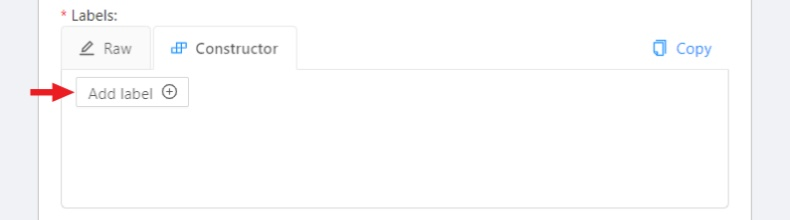
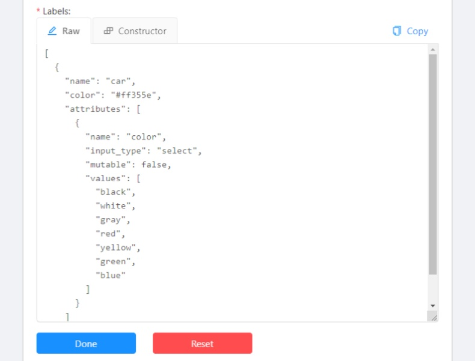
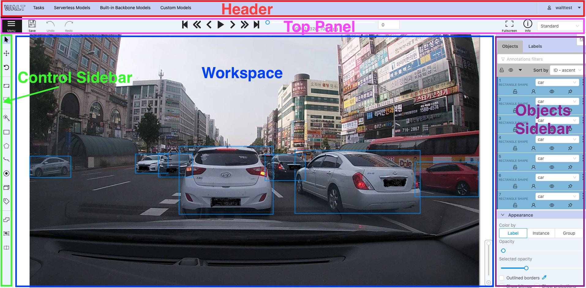
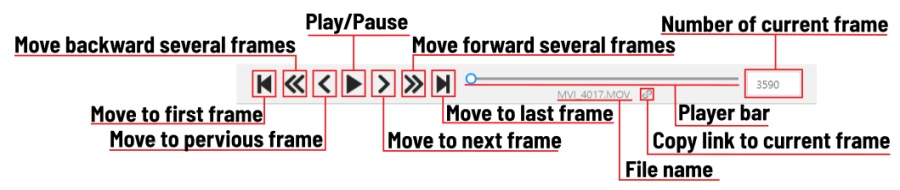
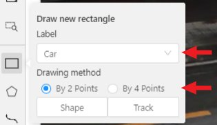

- [User's guide](#users-guide)
  - [Getting started](#getting-started)
    - [Authorization](#authorization)
    - [Creating an annotation task](#creating-an-annotation-task)
    - [Models](#models)
    - [Search](#search)
  - [Interface of the annotation tool](#interface-of-the-annotation-tool)
    - [Basic navigation](#basic-navigation)
    - [Types of shapes (basics)](#types-of-shapes-basics)
    - [Shape mode (basics)](#shape-mode-basics)
    - [Track mode (basics)](#track-mode-basics)
    - [Attribute annotation mode (basics)](#attribute-annotation-mode-basics)
    - [Downloading annotations](#downloading-annotations)
    - [Task synchronization with a repository](#task-synchronization-with-a-repository)
    - [Vocabulary](#vocabulary)
    - [Workspace](#workspace)
    - [Settings](#settings)
    - [Top Panel](#top-panel)
    - [Controls sidebar](#controls-sidebar)
    - [Objects sidebar](#objects-sidebar)
      - [Objects](#objects)
      - [Labels](#labels)
  - [Shape mode (advanced)](#shape-mode-advanced)
  - [Track mode (advanced)](#track-mode-advanced)
  - [Attribute annotation mode (advanced)](#attribute-annotation-mode-advanced)
  - [AI Tools](#ai-tools)
  - [Annotation with rectangle by 4 points](#annotation-with-rectangle-by-4-points)
  - [Annotation with polygons](#annotation-with-polygons)
  - [Annotation with polylines](#annotation-with-polylines)
  - [Annotation with points](#annotation-with-points)
    - [Points in shape mode](#points-in-shape-mode)
    - [Linear interpolation with one point](#linear-interpolation-with-one-point)
  - [Annotation with cuboids](#annotation-with-cuboids)
  - [Annotation with tags](#annotation-with-tags)
  - [Track mode with polygons](#track-mode-with-polygons)
  - [Automatic annotation](#automatic-annotation)
  - [Shape grouping](#shape-grouping)
  - [Filter](#filter)
  - [Analytics](#analytics)
  - [Shortcuts](#shortcuts)
  
  
  
  # User's guide

Withsystem AI Labeling Tool (WALT) is a web-based tool which helps to annotate videos and images for Computer Vision algorithms and 
to develo AI model and service prototype. WALT has many powerful features: _interpolation of bounding boxes between key frames, 
automatic annotation using deep learning models,shortcuts for most of critical actions, dashboard with a list of annotation tasks, etc...

## Getting started

### Authorization

- First of all, you have to send the request message to WALT's manager(charlescho64@gmail.com).

### Creating an annotation task

1.  Create an annotation task pressing `Create new task` button on the main page.
    

1.  Specify parameters of the task:

    #### Basic configuration
    
    **Name** The name of the task to be created.

    

    **Labels**. There are two ways of working with labels:

    - The `Constructor` is a simple way to add and adjust labels. To add a new label click the `Add label` button.
      

      You can set a name of the label in the `Label name` field and choose a color for each label.

      

      If necessary you can add an attribute and set its properties by clicking `Add an attribute`:

      

      The following actions are available here:

      1. Set the attribute’s name.
      1. Choose the way to display the attribute:
         - Select — drop down list of value
         - Radio — is used when it is necessary to choose just one option out of few suggested.
         - Checkbox — is used when it is necessary to choose any number of options out of suggested.
         - Text — is used when an attribute is entered as a text.
         - Number — is used when an attribute is entered as a number.
      1. Set values for the attribute. The values could be separated by pressing `Enter`.
         The entered value is displayed as a separate element which could be deleted
         by pressing `Backspace` or clicking the close button (x).
         If the specified way of displaying the attribute is Text or Number,
         the entered value will be displayed as text by default (e.g. you can specify the text format).
      1. Checkbox `Mutable` determines if an attribute would be changed frame to frame.
      1. You can delete the attribute by clicking the close button (x).

      Click the `Continue` button to add more labels.
      If you need to cancel adding a label - press the `Cancel` button.
      After all the necessary labels are added click the `Done` button.
      After clicking `Done` the added labels would be displayed as separate elements of different colour.
      You can edit or delete labels by clicking `Update attributes` or `Delete label`.

    - The `Raw` is a way of working with labels for an advanced user.
      Raw presents label data in _json_ format with an option of editing and copying labels as a text.
      The `Done` button applies the changes and the `Reset` button cancels the changes.
      

    In `Raw` and `Constructor` mode, you can press the `Copy` button to copy the list of labels.

    **Select files**. Press tab `My computer` to choose some files for annotation from your PC.
    If you select tab `Connected file share` you can choose files for annotation from your network.
    If you select ` Remote source` , you'll see a field where you can enter a list of URLs (one URL per line).
    If you upload a video data and select `Use cache` option, you can along with the video file attach a file with meta information.
    You can find how to prepare it [here](https://github.com/openvinotoolkit/cvat/blob/develop/utils/prepare_meta_information/README.md).

    

    #### Advanced configuration

    

    **Use zip chunks**. Force to use zip chunks as compressed data. Actual for videos only.

    **Use cache**. Defines how to work with data. Select the checkbox to switch to the "on-the-fly data processing",
    which will reduce the task creation time (by preparing chunks when requests are received)
    and store data in a cache of limited size with a policy of evicting less popular items.
    See more [here](https://github.com/openvinotoolkit/cvat/blob/develop/cvat/apps/documentation/data_on_fly.md).

    **Image Quality**. Use this option to specify quality of uploaded images.
    The option helps to load high resolution datasets faster.
    Use the value from `5` (almost completely compressed images) to `100` (not compressed images).

    **Overlap Size**. Use this option to make overlapped segments.
    The option makes tracks continuous from one segment into another.
    Use it for interpolation mode. There are several options for using the parameter:

    - For an interpolation task (video sequence).
      If you annotate a bounding box on two adjacent segments they will be merged into one bounding box.
      If overlap equals to zero or annotation is poor on adjacent segments inside a dumped annotation file,
      you will have several tracks, one for each segment, which corresponds to the object.
    - For an annotation task (independent images).
      If an object exists on overlapped segments, the overlap is greater than zero
      and the annotation is good enough on adjacent segments, it will be automatically merged into one object.
      If overlap equals to zero or annotation is poor on adjacent segments inside a dumped annotation file,
      you will have several bounding boxes for the same object.
      Thus, you annotate an object on the first segment.
      You annotate the same object on second segment, and if you do it right, you
      will have one track inside the annotations.
      If annotations on different segments (on overlapped frames)
      are very different, you will have two shapes for the same object.
      This functionality works only for bounding boxes.
      Polygons, polylines, points don't support automatic merge on overlapped segments
      even the overlap parameter isn't zero and match between corresponding shapes on adjacent segments is perfect.

    **Segment size**. Use this option to divide a huge dataset into a few smaller segments.
    For example, one job cannot be annotated by several labelers (it isn't supported).
    Thus using "segment size" you can create several jobs for the same annotation task.
    It will help you to parallel data annotation process.

    **Start frame**. Frame from which video in task begins.

    **Stop frame**. Frame on which video in task ends.

    **Frame Step**. Use this option to filter video frames.
    For example, enter `25` to leave every twenty fifth frame in the video or every twenty fifth image.

    **Chunk size**. Defines a number of frames to be packed in a chunk when send from client to server.
    Server defines automatically if empty.

    Recommended values:

    - 1080p or less: 36
    - 2k or less: 8 - 16
    - 4k or less: 4 - 8
    - More: 1 - 4

    **Dataset Repository**. URL link of the repository optionally specifies the path to the repository for storage
    (`default: annotation / <dump_file_name> .zip`).
    The .zip and .xml file extension of annotation are supported.
    Field format: `URL [PATH]` example: `https://github.com/project/repos.git [1/2/3/4/annotation.xml]`

    Supported URL formats :

    - `https://github.com/project/repos[.git]`
    - `github.com/project/repos[.git]`
    - `git@github.com:project/repos[.git]`

    The task will be highlighted in red after creation if annotation isn't synchronized with the repository.

    **Use LFS**. If the annotation file is large, you can create a repository with
    [LFS](https://git-lfs.github.com/) support.

    **Issue tracker**. Specify full issue tracker's URL if it's necessary.

    Push `Submit` button and it will be added into the list of annotation tasks.
    Then, the created task will be displayed on a dashboard:

    

1.  The Dashboard contains elements and each of them relates to a separate task. They are sorted in creation order.
    Each element contains: task name, preview, progress bar, button `Open`, and menu `Actions`.
    Each button is responsible for a in menu `Actions` specific function:

    - `Dump Annotation` and `Export as a dataset` — download annotations or
      annotations and images in a specific format. The following formats are available:
      - [CVAT for video](https://github.com/openvinotoolkit/cvat/blob/develop/cvat/apps/documentation/xml_format.md#interpolation)
        is highlighted if a task has the interpolation mode.
      - [CVAT for images](https://github.com/openvinotoolkit/cvat/blob/develop/cvat/apps/documentation/xml_format.md#annotation)
        is highlighted if a task has the annotation mode.
      - [PASCAL VOC](http://host.robots.ox.ac.uk/pascal/VOC/)
      - [(VOC) Segmentation mask](http://host.robots.ox.ac.uk/pascal/VOC/) —
        archive contains class and instance masks for each frame in the png
        format and a text file with the value of each color.
      - [YOLO](https://pjreddie.com/darknet/yolo/)
      - [COCO](http://cocodataset.org/#format-data)
      - [TFRecord](https://www.tensorflow.org/tutorials/load_data/tf_records)
      - [MOT](https://motchallenge.net/)
      - [LabelMe 3.0](http://labelme.csail.mit.edu/Release3.0/)
      - [Datumaro](https://github.com/opencv/cvat/blob/develop/datumaro/)
    - `Upload annotation` is available in the same formats as in `Dump annotation`.
      - [CVAT](https://github.com/openvinotoolkit/cvat/blob/develop/cvat/apps/documentation/xml_format.md) accepts both video and image sub-formats.
    - `Automatic Annotation` — automatic annotation with OpenVINO toolkit.
      Presence depends on how you build CVAT instance.
    - `Open bug tracker` — opens a link to Issue tracker.
    - `Delete` — delete task.

    Push `Open` button to go to task details.

1.  Task details is a task page which contains a preview, a progress bar
    and the details of the task (specified when the task was created) and the jobs section.

    

    - The next actions are available on this page:
      1. Change the task’s title.
      1. Open `Actions` menu.
      1. Change issue tracker or open issue tracker if it is specified.
      1. Change labels.
         You can add new labels or add attributes for the existing labels in the Raw mode or the Constructor mode.
         By clicking `Copy` you will copy the labels to the clipboard.
      1. Assigned to — is used to assign a task to a person. Start typing an assignee’s name and/or
         choose the right person out of the dropdown list.
    - `Jobs` — is a list of all jobs for a particular task. Here you can find the next data:
      - Jobs name with a hyperlink to it.
      - Frames — the frame interval.
      - A status of the job. The status is specified by the user in the menu inside the job.
        There are three types of status: annotation, validation or completed.
        The status of the job is changes the progress bar of the task.
      - Started on — start date of this job.
      - Duration — is the amount of time the job is being worked.
      - Assignee is the user who is working on the job.
        You can start typing an assignee’s name and/or choose the right person out of the dropdown list.
      - `Copy`. By clicking Copy you will copy the job list to the clipboard.
        The job list contains direct links to jobs.

1.  Follow a link inside `Jobs` section to start annotation process.
    In some cases, you can have several links. It depends on size of your
    task and `Overlap Size` and `Segment Size` parameters. To improve
    UX, only the first chunk of several frames will be loaded and you will be able
    to annotate first images. Other frames will be loaded in background.

    

### Models

The Models page contains a list of deep learning (DL) models deployed for semi-automatic and automatic annotation.
To open the Models page, click the Models button on the navigation bar.
The list of models is presented in the form of a table. The parameters indicated for each model are the following:

- `Framework` the model is based on
- model `Name`
- model `Type`:
  - `detector` - used for automatic annotation (available in [detectors](#detectors) and [automatic annotation](#automatic-annotation))
  - `interactor` - used for semi-automatic shape annotation (available in [interactors](#interactors))
  - `tracker` - used for semi-automatic track annotation (available in [trackers](#trackers))
  - `reid` - used to combine individual objects into a track (available in [automatic annotation](#automatic-annotation))
- `Description` - brief description of the model
- `Labels` - list of the supported labels (only for the models of the `detectors` type)

### Search

There are several options how to use the search.

- Search within all fields (owner, assignee, task name, task status, task mode).
  To execute enter a search string in search field.
- Search for specific fields. How to perform:
  - `owner: admin` - all tasks created by the user who has the substring "admin" in his name
  - `assignee: employee` - all tasks which are assigned to a user who has the substring "employee" in his name
  - `name: mighty` - all tasks with the substring "mighty" in their names
  - `mode: annotation` or `mode: interpolation` - all tasks with images or videos.
  - `status: annotation` or `status: validation` or `status: completed` - search by status
  - `id: 5` - task with id = 5.
- Multiple filters. Filters can be combined (except for the identifier) ​​using the keyword ` AND`:
  - `mode: interpolation AND owner: admin`
  - `mode: annotation and status: annotation`

The search is case insensitive.

## Interface of the annotation tool

The tool consists of:

- `Header` - pinned header used to navigate CVAT sections and account settings;
- `Top panel` — contains navigation buttons, main functions and menu access;
- `Workspace` — space where images are shown;
- `Controls sidebar` — contains tools for navigating the image, zoom,
  creating shapes and editing tracks (merge, split, group)
- `Objects sidebar` — contains label filter, two lists:
  objects (on the frame) and labels (of objects on the frame) and appearance settings.

### Basic navigation

1.  Use arrows below to move to the next/previous frame.
    Use the scroll bar slider to scroll through frames.
    Almost every button has a shortcut.
    To get a hint about a shortcut, just move your mouse pointer over an UI element.

    

1.  To navigate the image, use the button on the controls sidebar.
    Another way an image can be moved/shifted is by holding the left mouse button inside
    an area without annotated objects.
    If the `Mouse Wheel` is pressed, then all annotated objects are ignored. Otherwise the
    a highlighted bounding box will be moved instead of the image itself.

    

1.  You can use the button on the sidebar controls to zoom on a region of interest.
    Use the button `Fit the image` to fit the image in the workspace.
    You can also use the mouse wheel to scale the image
    (the image will be zoomed relatively to your current cursor position).

    

### Types of shapes (basics)

There are five shapes which you can annotate your images with:

- `Rectangle` or `Bounding box`
- `Polygon`
- `Polyline`
- `Points`
- `Cuboid`
- `Tag`

And there is how they all look like:

 

 

 

`Tag` - has no shape in the workspace, but is displayed in objects sidebar.

### Shape mode (basics)

Usage examples:

- Create new annotations for a set of images.
- Add/modify/delete objects for existing annotations.

1.  You need to select `Rectangle` on the controls sidebar:

    

    Before you start, select the correct ` Label` (should be specified by you when creating the task)
    and ` Drawing Method` (by 2 points or by 4 points):

    

1.  Creating a new annotation in `Shape mode`:

    - Create a separate `Rectangle` by clicking on `Shape`.

      

    - Choose the opposite points. Your first rectangle is ready!

      

    - To learn about creating a rectangle using the by 4 point drawing method, ([read here](#annotation-by-rectangle-4-points)).

    - It is possible to adjust boundaries and location of the rectangle using a mouse.
      Rectangle's size is shown in the top right corner , you can check it by clicking on any point of the shape.
      You can also undo your actions using `Ctrl+Z` and redo them with `Shift+Ctrl+Z` or `Ctrl+Y`.

1.  You can see the `Object card` in the objects sidebar or open it by right-clicking on the object.
    You can change the attributes in the details section.
    You can perform basic operations or delete an object by clicking on the action menu button.

    

1.  The following figure is an example of a fully annotated frame with separate shapes.

    

    Read more in the section [shape mode (advanced)](#shape-mode-advanced).

### Track mode (basics)

Usage examples:

- Create new annotations for a sequence of frames.
- Add/modify/delete objects for existing annotations.
- Edit tracks, merge several rectangles into one track.

1.  Like in the `Shape mode`, you need to select a `Rectangle` on the sidebar,
    in the appearing form, select the desired `Label` and the `Drawing method`.

    

1.  Creating a track for an object (look at the selected car as an example):

    - Create a `Rectangle` in `Track mode` by clicking on `Track`.

      

    - In `Track mode` the rectangle will be automatically interpolated on the next frames.
    - The cyclist starts moving on frame #2270. Let's mark the frame as a key frame.
      You can press `K` for that or click the `star` button (see the screenshot below).

      

    - If the object starts to change its position, you need to modify the rectangle where it happens.
      It isn't necessary to change the rectangle on each frame, simply update several keyframes
      and the frames between them will be interpolated automatically.
    - Let's jump 30 frames forward and adjust the boundaries of the object. See an example below:

      

    - After that the rectangle of the object will be changed automatically on frames 2270 to 2300:

      

1.  When the annotated object disappears or becomes too small, you need to
    finish the track. You have to choose `Outside Property`, shortcut `O`.

    

1.  If the object isn't visible on a couple of frames and then appears again,
    you can use the `Merge` feature to merge several individual tracks
    into one.

    

    - Create tracks for moments when the cyclist is visible:

      

    - Click `Merge` button or press key `M` and click on any rectangle of the first track
      and on any rectangle of the second track and so on:

      

    - Click `Merge` button or press `M` to apply changes.

      

    - The final annotated sequence of frames in `Interpolation` mode can
      look like the clip below:

      

      Read more in the section [track mode (advanced)](#track-mode-advanced).

### Attribute annotation mode (basics)   

